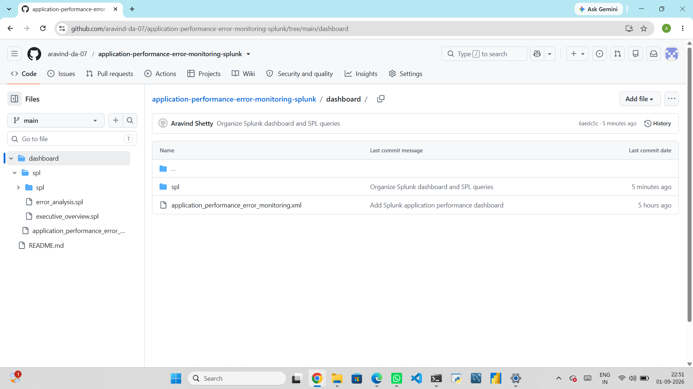

\# Application Performance \& Error Monitoring using Splunk


\## 📊 Project Overview


This project is an application performance and error monitoring solution built using \*\*Splunk\*\* and \*\*Search Processing Language (SPL)\*\*.


The dashboard provides a centralized view of application traffic, request performance, HTTP status codes, errors, endpoints, servers, clients, environments, and response times.


The project demonstrates how log data can be transformed into actionable monitoring insights through SPL queries and interactive dashboard visualizations.


\---


## 📸 Dashboard Preview




\## 🎯 Business Objective


The objective of this project is to help application and operations teams:


\- Monitor application request volume and traffic patterns

\- Identify HTTP errors and error-prone endpoints

\- Analyze application response times

\- Identify slow-performing requests

\- Monitor server-level errors

\- Understand client request activity

\- Compare application environments

\- Investigate individual error events

\- Quickly identify potential application performance issues


\---


\## 🛠️ Technologies Used


| Technology | Purpose |

|---|---|

| \*\*Splunk\*\* | Log analysis and dashboarding |

| \*\*SPL\*\* | Data extraction, transformation and analysis |

| \*\*Splunk Dashboard XML\*\* | Dashboard configuration |

| \*\*Git \& GitHub\*\* | Version control and project management |

| \*\*PowerShell\*\* | Local Git and project management |


\---


\## 🏗️ Project Architecture


```text

Application / Log Data

&#x20;       │

&#x20;       ▼

&#x20;  Splunk Index

&#x20;       │

&#x20;       ▼

&#x20;Search Processing Language (SPL)

&#x20;       │

&#x20;       ├── Request Analysis

&#x20;       ├── Performance Analysis

&#x20;       ├── Error Analysis

&#x20;       ├── Client Analysis

&#x20;       └── Server Analysis

&#x20;       │

&#x20;       ▼

&#x20;Interactive Splunk Dashboard

&#x20;       │

&#x20;       ▼

&#x20;Monitoring \& Data-Driven Insights


